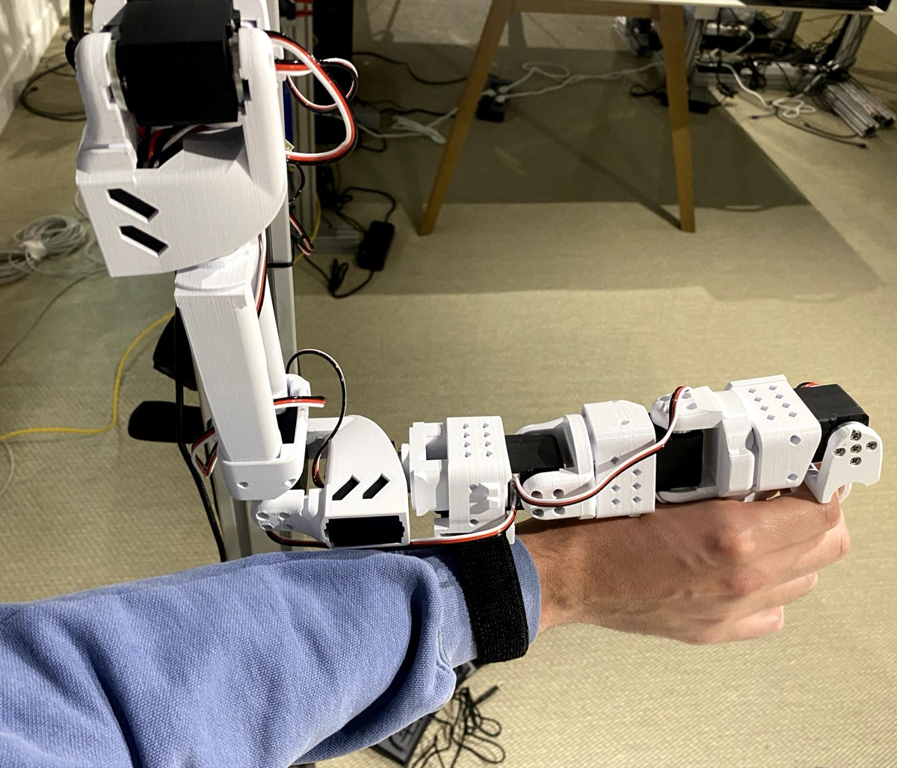
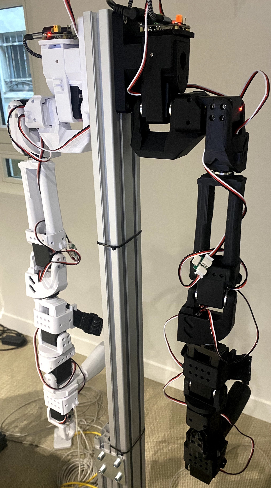

# Open Arms Mini

**Small, low-inertia leader arms for robot teleoperation**



*Open Arms Mini leader arm with wrist strap, designed for precise, fast teleoperation*

---

## What is Open Arms Mini?

Open Arms Mini is a compact, Feetech-based, 3D-printed leader arm designed for teleoperation of robot manipulators. It is based on the SO-101 design and pairs directly with SO-101 or SO-100 follower arms using [LeRobot](https://github.com/huggingface/lerobot).

### Why not just use a full-size arm as a leader?

We started teleoperation with full-size Open Arms as leader arms — the same kinematics as the follower, one-to-one mapping. It seemed like the natural choice. In practice, two problems emerged:

1. **Too much inertia.** Full-size arms are heavy enough that operators couldn't move quickly or precisely. Tasks like cloth folding require fast, deliberate wrist motions that full-size leaders simply can't support comfortably.
2. **Operator size mismatch.** A leader arm sized for one person is awkward for another. Operators varied significantly in height, making consistent, repeatable motions hard to achieve.

Open Arms Mini solves both:

| Property | Full-size leader | Open Arms Mini |
|---|---|---|
| Inertia | High — tiring, imprecise | Low — quick, deliberate |
| Arm-length fit | Fixed kinematics | Wrist-grip, works for anyone |
| Cost per arm | ~400 EUR | **~120 EUR** |
| DAgger support | Yes | Yes |
| Wrist precision | Low without strap | High with wrist strap |

### The wrist strap

One detail turned out to be critical: the wrist strap. Without it, wrist rotations are imprecise — the hand slips relative to the arm. With the strap, the operator's wrist is locked into the handle, giving exact wrist roll control. This is essential for cloth manipulation and any task requiring precise end-effector orientation.



*Open Arms Mini (white, left) paired with a full-size follower arm (black, right)*

---

## Bill of Materials

See [BOM.md](BOM.md) for the full bill of materials with links and prices.

**Approximate cost: ~120 EUR per arm** (excluding 3D printing filament and screws).

---

## 3D Printing

### Print settings

| Setting | Recommendation |
|---|---|
| Material | PLA or PETG |
| Layer height | 0.2 mm |
| Infill | 20–40% |
| Supports | Yes, where needed |
| Nozzle | 0.4 mm |

All parts print without post-processing beyond removing supports. A standard FDM printer with a ~220×220 mm bed is sufficient.

### Parts list

All STL files are in the [`STL/`](STL/) directory. STEP files (for modification) are in [`STEP/`](STEP/).

| File | Description | Qty |
|---|---|---|
| `J1 v5.stl` | Base / shoulder pan joint | 1 |
| `J1_holder v1.stl` | Shoulder pan motor holder | 1 |
| `J2 v2.stl` | Shoulder lift joint | 1 |
| `J2_holder v1.stl` | Shoulder lift motor holder | 1 |
| `J3 v2.stl` | Elbow flex joint | 1 |
| `J4 v3.stl` | Wrist flex joint | 1 |
| `J4_holder v1.stl` | Wrist flex motor holder | 1 |
| `J5 v4.stl` | Wrist roll joint | 1 |
| `J6 v6.stl` | Gripper body | 1 |
| `J6 holder with strap v4.stl` | Gripper / wrist strap holder | 1 |
| `J7 v4.stl` | Handle connector | 1 |
| `J7_holder v1.stl` | Handle motor holder | 1 |
| `J8 L v4.stl` | Gripper claw — left | 1 |
| `J8 R v10.stl` | Gripper claw — right | 1 |
| `J8 holder L v2.stl` | Gripper claw holder — left | 1 |
| `J8 holder R v6.stl` | Gripper claw holder — right | 1 |
| `J Handle v12.stl` | Main handle | 1 |
| `J trigger L v2.stl` | Trigger — left | 1 |
| `J trigger R v2.stl` | Trigger — right | 1 |
| `WaveShare_Mounting_Plate_SO101 v1.stl` | WaveShare servo controller mounting plate | 1 |
| `arducam_holder v6.stl` | Arducam camera mount (optional) | 1 |

---

## Assembly

### Hardware required

- 6× Feetech STS3215-C046 servo (7.4 V, 1:147 gear ratio)
- 1× Waveshare Serial Bus Servo Driver Board
- M2×6 mm screws (×~30)
- M3×6 mm screws (×~30)
- Motor horn screws M3×6 mm (×6, one per motor — usually included with motors)
- 3-pin servo cables (×6)
- 7.5 V DC power supply (2 A or more)
- 1× Velcro/elastic wrist strap (~25 mm wide)

### Step-by-step

#### Prepare motors

Before assembly, configure each motor's ID and baudrate using LeRobot (see [LeRobot Integration](#lerobot-integration) below). It is easier to do this before the motors are installed in the arm.

Connect each motor individually to the Waveshare board and run:

```bash
lerobot-setup-motors \
    --teleop.type=so101_leader \
    --teleop.port=/dev/tty.usbmodem575E0031751
```

Follow the prompts to set motor IDs 1–6 in order.

#### Motor ID assignment

| ID | Joint | Part |
|---|---|---|
| 1 | Base / Shoulder Pan | J1 |
| 2 | Shoulder Lift | J2 |
| 3 | Elbow Flex | J3 |
| 4 | Wrist Flex | J4 |
| 5 | Wrist Roll | J5 |
| 6 | Gripper | J6 + J8 L/R |

#### Assembly order

1. **Joint 1 (Base)** — Insert motor 1 into J1. Secure with 4× M2×6 screws. Attach J1_holder with 2× M2×6 screws. Install both motor horns; secure top horn with 1× M3×6 screw.
2. **Joint 2 (Shoulder)** — Slide motor 2 into J2 from above. Fasten with 4× M2×6 screws. Attach both motor horns with 1× M3×6 horn screw. Connect J2 to J1 with 4× M3×6 screws each side.
3. **Joint 3 (Elbow)** — Insert motor 3 into J3. Fasten with 4× M2×6 screws. Attach motor horns. Connect J3 to J2 with 4× M3×6 screws each side.
4. **Joint 4 (Wrist Flex)** — Slide J4_holder over J3. Insert motor 4 and fasten with 4× M2×6 screws. Attach both motor horns with horn screw.
5. **Joint 5 (Wrist Roll)** — Insert motor 5 into J5 and secure with 2× M2×6 front screws. Install one motor horn only. Secure J5 to motor 4 with 4× M3×6 screws each side.
6. **Gripper** — Attach J6 to motor 5 horn with 4× M3×6 screws. Insert motor 6 and secure with 2× M2×6 screws each side. Attach motor horns. Install J8 L and J8 R gripper claws with J8 holders, using 4× M3×6 screws each side. Attach triggers (J trigger L, J trigger R).
7. **Handle** — Attach J Handle to the gripper body. Mount J6 holder with strap around the wrist area.
8. **Wrist strap** — Thread a 25 mm elastic velcro strap through the strap holder on J6. Adjust tightness so the operator's wrist is firmly locked but comfortable.
9. **Controller board** — Mount the Waveshare board on the WaveShare_Mounting_Plate_SO101 and attach to the base. Daisy-chain all motors with 3-pin cables from motor 1 (shoulder pan) through to motor 6 (gripper).

---

## LeRobot Integration

Open Arms Mini is fully supported by [LeRobot](https://github.com/huggingface/lerobot) as a `so101_leader` teleoperator.

### Install LeRobot

```bash
pip install lerobot[feetech]
```

### Find USB port

```bash
lerobot-find-port
```

### Configure motors

```bash
lerobot-setup-motors \
    --teleop.type=so101_leader \
    --teleop.port=/dev/tty.usbmodem575E0031751
```

### Calibrate

```bash
lerobot-calibrate \
    --teleop.type=so101_leader \
    --teleop.port=/dev/tty.usbmodem575E0031751 \
    --teleop.id=my_mini_leader_arm
```

### Teleoperate

Pair Open Arms Mini with an SO-101 follower arm:

```bash
lerobot-teleoperate \
    --robot.type=so101_follower \
    --robot.port=/dev/tty.usbmodem585A0076841 \
    --robot.id=my_follower \
    --teleop.type=so101_leader \
    --teleop.port=/dev/tty.usbmodem575E0031751 \
    --teleop.id=my_mini_leader_arm
```

Full instructions: [LeRobot SO-101 documentation](https://huggingface.co/docs/lerobot/so101)

---

## License

Hardware designs released under [Apache 2.0](LICENSE). Based on the [SO-ARM100](https://github.com/TheRobotStudio/SO-ARM100) design.
